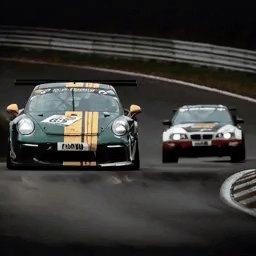

<h2> Follow-Your-Click 
   
Open-domain Regional Image Animation via Short Prompts</h2>

[Yue Ma*](https://mayuelala.github.io/), [Yingqing He*](https://github.com/YingqingHe), [Hongfa Wang*](https://github.com/mayuelala/FollowYourClick), [Andong Wang](https://github.com/mayuelala/FollowYourClick), [Chenyang Qi](https://chenyangqiqi.github.io/), [Chengfei Cai](https://github.com/mayuelala/FollowYourClick), [Xiu Li](https://scholar.google.com/citations?user=Xrh1OIUAAAAJ&hl=zh-CN), [Zhifeng Li](https://scholar.google.com/citations?view_op=list_works&hl=zh-CN&hl=zh-CN&user=VTrRNN4AAAAJ&sortby=pubdate),  
[Heung-Yeung Shum](https://scholar.google.com.hk/citations?user=9akH-n8AAAAJ&hl=en), [Wei Liu](https://scholar.google.com/citations?user=AjxoEpIAAAAJ&hl=zh-CN) and [Qifeng Chen](https://cqf.io)

 
     

# 🖼 Gallery

We have showcased some results of image animation using Follow-Your-Click on generated images below.

More results can be found on our [Project page](https://follow-your-click.github.io/).

<table>
  <tr>
    <td></td>
    <td></td>
    <td></td>
    <td></td>
    <td></td>
    <td></td>
  </tr>
  <tr>
    <td colspan="2">
"Tune the head"
</td>
    <td colspan="2">
"Flap the wings"
</td>
    <td colspan="2">
"Storm"
</td>
  </tr>
  <tr>
    <td></td>
    <td></td>
    <td></td>
    <td></td>
    <td></td>
    <td></td>
  </tr>
  <tr>
    <td colspan="2">
"Smile"
</td>
    <td colspan="2">
"Sad"
</td>
    <td colspan="2">
"Launch"
</td>
  </tr>
  <tr>
    <td></td>
    <td></td>
    <td></td>
    <td></td>
    <td></td>
    <td></td>
  </tr>
  <tr>
    <td colspan="2">
"Drift"
</td>
    <td colspan="2">
"Dancing"
</td>
    <td colspan="2">
"Drive back and forward"
</td>
  </tr>
</table>

# 📍 Note  
### 🕹 We are cleaning the code and creating a demo. We really want everybody to try it! 
### 😊 The code and checkpoints will be released in April！
### 💗 Thanks for your attention! If you are interested in our work, please give us a star ⭐️⭐️⭐ to let us know.
### 🚀 We will speed up the development! 

